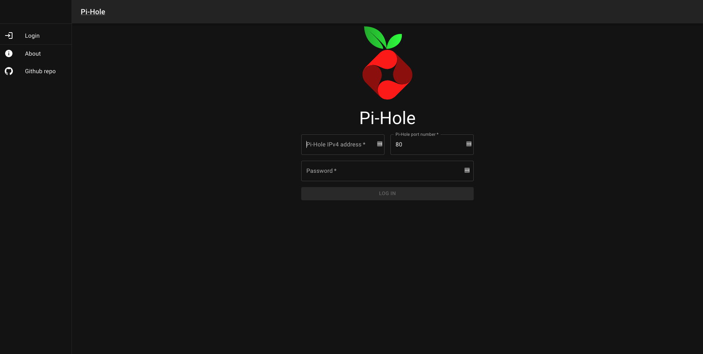
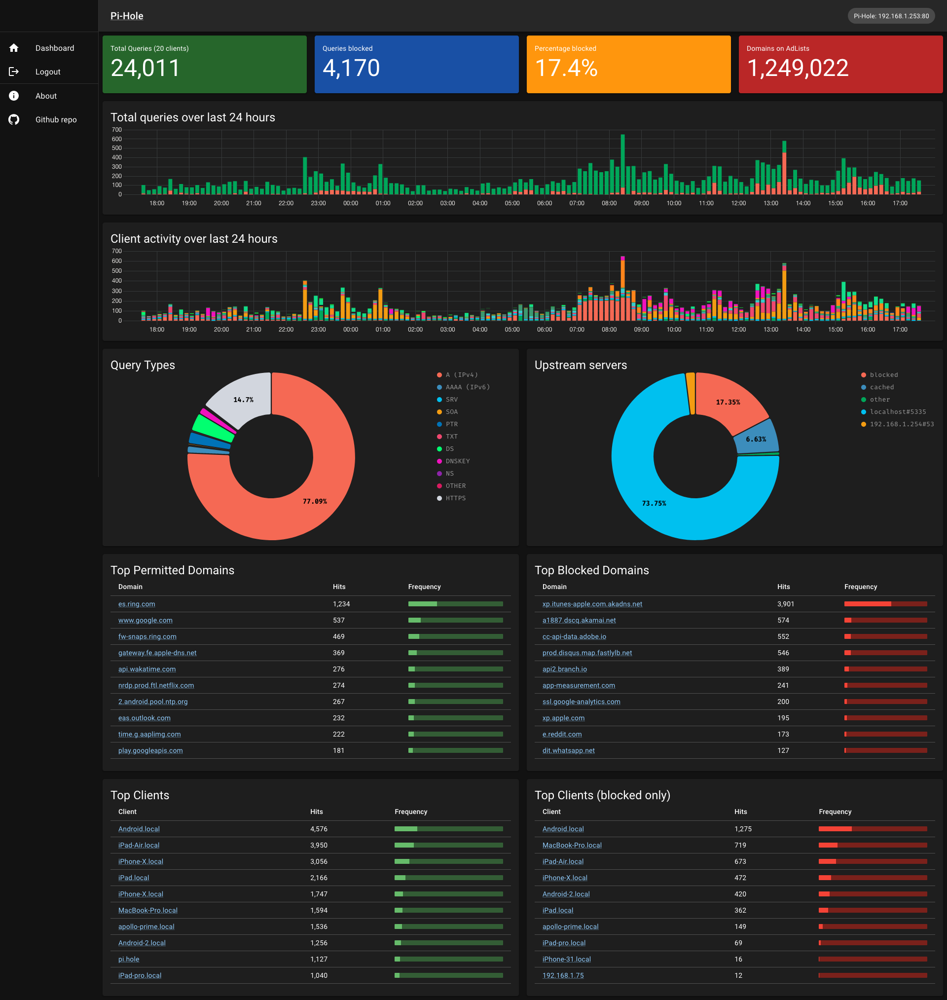

# pihole-dashboard

3rd party Pi-hole Admin portal written in [NextJS](https://nextjs.org/) and styled with [Material-UI](https://mui.com/)

Based on [Pi-Hole Admin portal](https://github.com/pi-hole/AdminLTE), but written in ReactJS using [NextJS](https://nextjs.org/)

## Getting Started

### Development server

```bash
npm run dev
```

### Production server

```bash
npm run build;
npm run start;
```

---

## Screenshots

<details>
<summary>Show screenshots</summary>

### Login page



### Home page



</details>

---

## Table of contents

- [pihole-dashboard](#pihole-dashboard)
  - [Getting Started](#getting-started)
    - [Development server](#development-server)
    - [Production server](#production-server)
  - [Screenshots](#screenshots)
    - [Login page](#login-page)
    - [Home page](#home-page)
  - [Table of contents](#table-of-contents)
  - [NPM scripts](#npm-scripts)
  - [Environment variables](#environment-variables)
  - [pages](#pages)
    - [Login](#login)
    - [Home](#home)
  - [api](#api)
    - [`/api/auth/*`](#apiauth)
      - [`/api/auth/login`](#apiauthlogin)
      - [`/api/auth/logout`](#apiauthlogout)
      - [`/api/auth/session`](#apiauthsession)
      - [`/api/auth/unauthorized`](#apiauthunauthorized)
    - [`/api/queries/*`](#apiqueries)
      - [`/api/queries/clients/*`](#apiqueriesclients)
        - [`/api/queries/clients/overtime`](#apiqueriesclientsovertime)
          - [Raw](#raw)
          - [Formatted](#formatted)
        - [`/api/queries/clients/topAllowed`](#apiqueriesclientstopallowed)
        - [`/api/queries/clients/topBlocked`](#apiqueriesclientstopblocked)
      - [`/api/queries/domains/*`](#apiqueriesdomains)
        - [`/api/queries/domains/topAllowed`](#apiqueriesdomainstopallowed)
        - [`/api/queries/domains/topBlocked`](#apiqueriesdomainstopblocked)
      - [`/api/queries/forwardedDestinations`](#apiqueriesforwardeddestinations)
      - [`/api/queries/overtime`](#apiqueriesovertime)
        - [Raw](#raw-1)
        - [Formatted](#formatted-1)
      - [`/api/queries/queryTypes`](#apiqueriesquerytypes)
      - [`/api/queries/summary`](#apiqueriessummary)
        - [Raw](#raw-2)
        - [Formatted](#formatted-2)
  - [Protected routes](#protected-routes)
    - [Pages](#pages-1)
    - [API](#api-1)
  - [Research resources](#research-resources)

---

## NPM scripts

- utils

  - `repoStatus`: return string `clean` or `dirty`
    - if repo has uncommited changes it will return `dirty`
    - if repo has **NO** uncomitted changes, it will return `clean`
  - `repoLatestTag`: get the latest git tag or use `version` from `package.json`
  - `generateVersion`: generate tag with following structure
    - <`repoLatestTag`>-dev-<`repoStatus`>
      - Ex: 0.1.0-dev-clean
      - Ex: 0.1.0-dev-dirty
  - `generateBuildId`: get the latest commit sha ID or `development`
    - Ex: 1683a9b
    - Ex: development
  - `generateEnv`: runs [`generateEnvs.sh`](./generateEnvs.sh)
  - `docker:imagename`: the name of docker image. This will run when making docker image
  - `docker:tagname`: the tagname of the docker image. This will run when making docker image

- nextjs
  - `dev`: run script `generateEnv` and start development NextJS server
  - `build`: build NextJS project
    - NOTE: when building the project, make sure the ENV variables are created properly on file `.env.local`
      - Go to [Environment variables](#environment-variables)
  - `start`: start NextJS project using the files generated from script `build`
- lint
  - `lint:eslint`: Run eslint to lint code
  - `lint:tsc`: Run Typescript to lint code
  - `lint`: Run script `lint:eslint` and `lint:tsc`
- docker
  - `docker:build`: builds docker image
    - image name: runs npm script `docker:imagename`
    - image tagname: runs npm script `docker:tagname`
  - `docker:run`: runs the docker image
    - image name: runs npm script `docker:imagename`
    - image tagname: runs npm script `docker:tagname`
  - `docker:stop`: stops docker container
    - container name: runs npm script `docker:imagename`
  - `docker:logs`
    - container name: runs npm script `docker:imagename`

---

## Environment variables

This project uses environment variables in order for the NextJS project to work.

| environment variable                                | default  | usage                                                                                                                 | used by                                                                |
| --------------------------------------------------- | -------- | --------------------------------------------------------------------------------------------------------------------- | ---------------------------------------------------------------------- |
| SECRET_COOKIE_PASSWORD                              | n/a      | encrypting session cookie (32 character long. check [iron-session](https://github.com/vvo/iron-session#ironoptions))  | [Iron session cookies](https://github.com/vvo/iron-session)            |
| SECURE_COOKIE_TTL                                   | n/a      | session cookie TTL (time to live) in seconds. check [iron-session](https://github.com/vvo/iron-session#ironoptions)   | [Iron session cookies](https://github.com/vvo/iron-session)            |
| NEXT_PUBLIC_POLLING_AUTH_SESSION                    | `1000`   | Fetch polling time (in milliseconds) for api [`/api/auth/session`](#apiauthsession)                                   | [Redux Toolkit Query](https://redux-toolkit.js.org/rtk-query/overview) |
| NEXT_PUBLIC_POLLING_SUMMARY                         | `2000`   | Fetch polling time (in milliseconds) for api [`/api/queries/summary`](#apiqueriessummary)                             | [Redux Toolkit Query](https://redux-toolkit.js.org/rtk-query/overview) |
| NEXT_PUBLIC_POLLING_FORWARDED_DESTINATIONS          | `60000`  | Fetch polling time (in milliseconds) for api [`/api/queries/forwardedDestinations`](#apiqueriesforwardeddestinations) | [Redux Toolkit Query](https://redux-toolkit.js.org/rtk-query/overview) |
| NEXT_PUBLIC_POLLING_QUERY_TYPES                     | `60000`  | Fetch polling time (in milliseconds) for api [`/api/queries/overtime`](#apiqueriesovertime)                           | [Redux Toolkit Query](https://redux-toolkit.js.org/rtk-query/overview) |
| NEXT_PUBLIC_POLLING_TOP_PERMITTED_QUERIES           | `10000`  | Fetch polling time (in milliseconds) for api [`/api/queries/domains/topAllowed`](#apiqueriesdomainstopallowed)        | [Redux Toolkit Query](https://redux-toolkit.js.org/rtk-query/overview) |
| NEXT_PUBLIC_POLLING_TOP_BLOCKED_QUERIES             | `10000`  | Fetch polling time (in milliseconds) for api [`/api/queries/domains/topBlocked`](#apiqueriesdomainstopblocked)        | [Redux Toolkit Query](https://redux-toolkit.js.org/rtk-query/overview) |
| NEXT_PUBLIC_NUM_ENTRIES_TOP_PERMITTED_QUERIES       | `10`     | Number of entries to fetch from api [`/api/queries/domains/topAllowed`](#apiqueriesdomainstopallowed)                 | [Redux Toolkit Query](https://redux-toolkit.js.org/rtk-query/overview) |
| NEXT_PUBLIC_NUM_ENTRIES_TOP_BLOCKED_QUERIES         | `10`     | Number of entries to fetch from api [`/api/queries/domains/topBlocked`](#apiqueriesdomainstopblocked)                 | [Redux Toolkit Query](https://redux-toolkit.js.org/rtk-query/overview) |
| NEXT_PUBLIC_POLLING_TOP_CLIENTS_ALLOWED_QUERIES     | `10000`  | Fetch polling time (in milliseconds) for api [`/api/queries/clients/topAllowed`](#apiqueriesclientstopallowed)        | [Redux Toolkit Query](https://redux-toolkit.js.org/rtk-query/overview) |
| NEXT_PUBLIC_POLLING_TOP_CLIENTS_BLOCKED_QUERIES     | `10000`  | Fetch polling time (in milliseconds) for api [`/api/queries/clients/topBlocked`](#apiqueriesclientstopblocked)        | [Redux Toolkit Query](https://redux-toolkit.js.org/rtk-query/overview) |
| NEXT_PUBLIC_NUM_ENTRIES_TOP_CLIENTS_ALLOWED_QUERIES | `10`     | Number of entries to fetch from api [`/api/queries/clients/topAllowed`](#apiqueriesclientstopallowed)                 | [Redux Toolkit Query](https://redux-toolkit.js.org/rtk-query/overview) |
| NEXT_PUBLIC_NUM_ENTRIES_TOP_CLIENTS_BLOCKED_QUERIES | `10`     | Number of entries to fetch from api [`/api/queries/clients/topBlocked`](#apiqueriesclientstopblocked)                 | [Redux Toolkit Query](https://redux-toolkit.js.org/rtk-query/overview) |
| NEXT_PUBLIC_POLLING_QUERIES_OVERTIME                | `600000` | Fetch polling time (in milliseconds) for api [`/api/queries/overtime`](#apiqueriesovertime)                           | [Redux Toolkit Query](https://redux-toolkit.js.org/rtk-query/overview) |
| NEXT_PUBLIC_POLLING_CLIENTS_OVERTIME                | `600000` | Fetch polling time (in milliseconds) for api [`/api/queries/clients/overtime`](#apiqueriesclientsovertime)            | [Redux Toolkit Query](https://redux-toolkit.js.org/rtk-query/overview) |

---

## pages

All pages in the project

### Login

Used for logging into the dashboard

It requires a valid `IPv4` address, port number and password (the same as Pi-hole admin portal)

The IP address and port number is required because these two values will be used to connect with
Pi-hole API

If the authentication is successful, then the user will be redirected to the `Home` page

The login session is valid for the time set in the ENV variable `SECURE_COOKIE_TTL`

- check [ENV variables](#environment-variables)

### Home

displays basic information about Pi-hole statistics.

- Summary
  - number of queries made to Pi-hole
  - number of blocked queries
  - percentage of blocked queries and total queries
  - total number entries in ad block list
- charts
  - bar chart of queries in the last 24 hours (blocked vs allowed)
  - bar chart of queries made by clients in the last 24 hours
  - doughnut chart of query types (ex: AAAA, HTTPS, DS)
  - doughnut chart of upstream servers
    - who handled the query (blocked by ad list, allowed, sent to router, sent to DNS resolver (Google DNS))
- tables
  - top allowed domains
  - top blocked domains
  - top queries made by clients in Pi-hole
  - top blocked queries made by clients in Pi-hole

data are fetched using Redux Toolkit Query.
The data fetched in a polling form (refetch at an interval).
These polling times are set using ENVs

- check [ENV variables](#environment-variables)

---

## api

<!--
loaded tree structure with
tree -a -H "./src/pages/api/" ./src/pages/api/
 -->
 <pre>
./src/pages/<a href="./src/pages/api">api/</a>
├── <a href="./src/pages/api/auth/">auth</a>
│   ├── <a href="./src/pages/api/auth/login.ts">login.ts</a>
│   ├── <a href="./src/pages/api/auth/logout.ts">logout.ts</a>
│   ├── <a href="./src/pages/api/auth/session.ts">session.ts</a>
│   └── <a href="./src/pages/api/auth/unauthorized.ts">unauthorized.ts</a>
└── <a href="./src/pages/api/queries/">queries</a>
    ├── <a href="./src/pages/api/queries/clients/">clients</a>
    │   ├── <a href="./src/pages/api/queries/clients/overtime.ts">overtime.ts</a>
    │   ├── <a href="./src/pages/api/queries/clients/topAllowed.ts">topAllowed.ts</a>
    │   └── <a href="./src/pages/api/queries/clients/topBlocked.ts">topBlocked.ts</a>
    ├── <a href="./src/pages/api/queries/domains/">domains</a>
    │   ├── <a href="./src/pages/api/queries/domains/topAllowed.ts">topAllowed.ts</a>
    │   └── <a href="./src/pages/api/queries/domains/topBlocked.ts">topBlocked.ts</a>
    ├── <a href="./src/pages/api/queries/forwardedDestinations.ts">forwardedDestinations.ts</a>
    ├── <a href="./src/pages/api/queries/overtime.ts">overtime.ts</a>
    ├── <a href="./src/pages/api/queries/queryTypes.ts">queryTypes.ts</a>
    └── <a href="./src/pages/api/queries/summary.ts">summary.ts</a>
 </pre>

---

### `/api/auth/*`

All authentication API endpoints

#### `/api/auth/login`

**logging in**

HTTP request type: `POST`

1. check if ip address is valid
2. check if port number is valid
3. check if Pi-hole admin portal credentials are valid
   1. if valid,
      1. create session cookie using [iron-session](https://github.com/vvo/iron-session).
      2. Return response `success`
   2. if **NOT** VALID
      1. return response `invalid credentials`

#### `/api/auth/logout`

**logging out**

HTTP request type: `DELETE`

1. invalidates session cookie using [iron-session cookie destroy](https://github.com/vvo/iron-session#sessiondestroy)
2. returns response `success`

#### `/api/auth/session`

**get current auth session**

HTTP request type: `GET`

1. checks if user is logged in using [iron-session](https://github.com/vvo/iron-session)
   1. if logged in
      1. return `IP address` and `port number` used to log in
   2. if NOT logged in
      1. return `IP address` and `port number` as empty strings

#### `/api/auth/unauthorized`

**return message unauthorized**

HTTP request type: `GET`

1. return response `Authorization required`

Used when accessing an API endpoint that requires authorization and the user is **NOT** logged in.

- check [protected routes](#protected-routes)

---

### `/api/queries/*`

All API endpoints regarding Pi-hole queries

**NOTE:** all endpoints under `/api/queries` are protected routes.

check [Protected routes](#protected-routes)

---

#### `/api/queries/clients/*`

Pi-hole Queries stats regarding clients

##### `/api/queries/clients/overtime`

**Data to graph queries overtime with the clients**

HTTP request type: `GET`

Pi-hole API endpoint: `http://<ip address>:<port>/admin/api.php?overTimeDataClients&getClientNames`

Example:

###### Raw

**Raw data returned from Pi-hole API endpoint**

HTTP request type: `GET`

API route: `/api/queries/clients/overtime`

Example:

```json
{
  "clients": [
    {
      "name": "iPad-Air.local",
      "ip": "192.168.1.85"
    },
    {
      "name": "MacBook-Pro.local",
      "ip": "192.168.1.67"
    },
    {
      "name": "pi.hole",
      "ip": "::"
    }
  ],
  "over_time": {
    "1667669700": [0, 0, 13, 15, 0, 0, 0, 0, 0, 1, 0, 0, 3, 0, 0, 22, 0, 1, 1, 0, 14, 112],
    "1667670300": [5, 0, 2, 0, 3, 0, 0, 1, 0, 3, 0, 0, 2, 0, 0, 16, 2, 0, 1, 0, 13, 5],
    "1667670900": [38, 0, 3, 20, 3, 0, 0, 2, 0, 0, 0, 0, 5, 0, 0, 5, 0, 2, 1, 0, 13, 1]
  }
}
```

###### Formatted

**Data formatted to be used by [ChartJS bar chart](https://www.chartjs.org/docs/latest/samples/bar/stacked.html)**

HTTP request type: `GET`

API route: `/api/queries/clients/overtime?formatted=true`

Example:

```json
{
  "labels": [1667669700000, 1667670300000, 1667670900000],
  "datasets": [
    {
      "data": [
        0, 5, 38, 6, 4, 11, 9, 38, 263, 196, 8, 5, 4, 4, 11, 237, 209, 196, 209, 201, 199, 210
      ],
      "backgroundColor": "#f56954",
      "label": "iPad-Air.local"
    },
    {
      "data": [236, 90, 61, 43, 53, 29, 64, 50, 32, 34, 56, 49, 38, 0, 60, 0, 54, 0, 30, 46, 0, 0],
      "backgroundColor": "#3c8dbc",
      "label": "MacBook-Pro.local"
    },
    {
      "data": [13, 2, 3, 39, 9, 49, 24, 7, 11, 3, 0, 4, 6, 5, 10, 10, 1, 2, 4, 0, 7, 3],
      "backgroundColor": "#00a65a",
      "label": "pi.hole"
    }
  ]
}
```

##### `/api/queries/clients/topAllowed`

**Data needed for generating the Top Clients list**

HTTP request type: `GET`

API route: `/api/queries/clients/topAllowed?numEntries=10`

Pi-hole API endpoint: `http://<ip address>:<port>/admin/api.php?topClients=10`

Example:

```json
{
  "iPad-Air.local|192.168.1.85": 5874,
  "iPhone-31.local|192.168.1.69": 3397,
  "Android.local|192.168.1.94": 2833,
  "iPhone.local|192.168.1.71": 2752,
  "iPad.local|192.168.1.68": 2315,
  "apollo-prime.local|192.168.1.82": 1878,
  "MacBook-Pro.local|192.168.1.93": 1681,
  "apollo-prime.local|192.168.1.78": 1456,
  "MacBook-Pro.local|192.168.1.67": 1437,
  "pi.hole|::": 1334
}
```

##### `/api/queries/clients/topBlocked`

**Data needed for generating the Top blocked Clients list**

HTTP request type: `GET`

API route: `/api/queries/clients/topBlocked?numEntries=10`

Pi-hole API endpoint: `http://<ip address>:<port>/admin/api.php?topClientsBlocked=10`

Example:

```json
{
  "apollo-prime.local|192.168.1.82": 1353,
  "iPad-Air.local|192.168.1.85": 948,
  "Android.local|192.168.1.94": 617,
  "iPad.local|192.168.1.68": 598,
  "MacBook-Pro.local|192.168.1.67": 563,
  "iPhone-31.local|192.168.1.69": 408,
  "iPhone.local|192.168.1.71": 320,
  "apollo-prime.local|192.168.1.78": 202,
  "Android.local|192.168.1.79": 74,
  "iPad-pro.local|192.168.1.87": 48
}
```

---

#### `/api/queries/domains/*`

Pi-hole Queries stats regarding domains

##### `/api/queries/domains/topAllowed`

**Data needed for generating the Top allowed Domain list**

HTTP request type: `GET`

API route: `/api/queries/domains/topBlocked?numEntries=10`

Pi-hole API endpoint: `http://<ip address>:<port>/admin/api.php?topItems=10`

Example:

```json
{
  "es.ring.com": 1157,
  "gateway.fe.apple-dns.net": 593,
  "www.google.com": 497,
  "fw-snaps.ring.com": 476,
  "eas.outlook.com": 341,
  "nrdp.prod.ftl.netflix.com": 304,
  "eat-efz.ms-acdc.office.com": 288,
  "2.android.pool.ntp.org": 274,
  "e673.dsce9.akamaiedge.net": 224,
  "play.googleapis.com": 212
}
```

##### `/api/queries/domains/topBlocked`

**Data needed for generating the Top blocked Domain list**

HTTP request type: `GET`

API route: `/api/queries/domains/topBlocked?numEntries=10`

Pi-hole API endpoint: `http://<ip address>:<port>/admin/api.php?topItems=10`

Example:

```json
{
  "xp.itunes-apple.com.akadns.net": 5260,
  "api2.branch.io": 949,
  "a1887.dscq.akamai.net": 752,
  "prod.disqus.map.fastlylb.net": 746,
  "cc-api-data.adobe.io": 370,
  "e.reddit.com": 351,
  "ssl.google-analytics.com": 322,
  "app-measurement.com": 275,
  "dit.whatsapp.net": 230,
  "xp.apple.com": 216
}
```

---

#### `/api/queries/forwardedDestinations`

**Shows number of queries that have been forwarded and the target**

HTTP request type: `GET`

API route: `/api/queries/forwardedDestinations`

Pi-hole API endpoint: `http://<ip address>:<port>/admin/api.php?getForwardDestinations`

Example:

```json
{
  "forward_destinations": {
    "blocked|blocked": 18.84,
    "cached|cached": 5.12,
    "other|other": 0.34,
    "localhost#5335|127.0.0.1#5335": 73.95,
    "192.168.1.254#53|192.168.1.254#53": 1.75
  }
}
```

---

#### `/api/queries/overtime`

**Data needed for generating the domains/ads over time graph on the Pi-hole web dashboard**

Pi-hole API endpoint: `http://<ip address>:<port>/admin/api.php?overTimeData10mins`

##### Raw

**Raw data returned from Pi-hole API endpoint**

HTTP request type: `GET`

API route: `/api/queries/overtime`

Example:

```json
{
  "domains_over_time": {
    "1667438100": 328,
    "1667438700": 239,
    "1667439300": 236,
    "1667439900": 384
  },
  "ads_over_time": {
    "1667438100": 57,
    "1667438700": 50,
    "1667439300": 41,
    "1667439900": 90
  }
}
```

##### Formatted

**Data formatted to be used by [ChartJS bar chart](https://www.chartjs.org/docs/latest/samples/bar/stacked.html)**

HTTP request type: `GET`

API route: `api/queries/overtime?formatted=true`

Example:

```json
{
  "labels": [1667438100000, 1667438700000, 1667439300000, 1667439900000],
  "datasets": [
    {
      "data": [57, 50, 41, 90],
      "backgroundColor": "#f56954",
      "label": "Blocked DNS Queries"
    },
    {
      "data": [271, 189, 195, 294],
      "backgroundColor": "#00a65a",
      "label": "Permitted DNS Queries"
    }
  ]
}
```

---

#### `/api/queries/queryTypes`

**Shows number of queries that the Pi-hole's DNS server has processed**

HTTP request type: `GET`

API route: `/api/queries/queryTypes`

Pi-hole API endpoint: `http://<ip address>:<port>/admin/api.php?getQueryTypes`

Example:

```json
{
  "querytypes": {
    "A (IPv4)": 66.99,
    "AAAA (IPv6)": 9.92,
    "ANY": 0,
    "SRV": 0.01,
    "SOA": 0.06,
    "PTR": 1.63,
    "TXT": 0,
    "NAPTR": 0,
    "MX": 0,
    "DS": 1.97,
    "RRSIG": 0,
    "DNSKEY": 1.01,
    "NS": 0.03,
    "OTHER": 0.08,
    "SVCB": 0,
    "HTTPS": 18.3
  }
}
```

---

#### `/api/queries/summary`

Summary Pi-hole statistics
Ex:

- number of queries handled
- number of queries blocked
- number of queries blocked in percentage
- number domains in adlist

##### Raw

**Gives statistics in raw format (no number formatting applied)**

HTTP request type: `GET`

API route `/api/queries/summary?raw=true`

Pi-hole API route: `http://<ip address>:<port>/admin/api.php?summaryRaw`

Example:

```json
{
  "domains_being_blocked": 1249022,
  "dns_queries_today": 35987,
  "ads_blocked_today": 5097,
  "ads_percentage_today": 14.163448,
  "unique_domains": 9354,
  "queries_forwarded": 25610,
  "queries_cached": 5205,
  "clients_ever_seen": 33,
  "unique_clients": 27,
  "dns_queries_all_types": 35987,
  "reply_UNKNOWN": 362,
  "reply_NODATA": 4693,
  "reply_NXDOMAIN": 798,
  "reply_CNAME": 19689,
  "reply_IP": 9878,
  "reply_DOMAIN": 2,
  "reply_RRNAME": 0,
  "reply_SERVFAIL": 0,
  "reply_REFUSED": 29,
  "reply_NOTIMP": 0,
  "reply_OTHER": 0,
  "reply_DNSSEC": 451,
  "reply_NONE": 0,
  "reply_BLOB": 85,
  "dns_queries_all_replies": 35987,
  "privacy_level": 0,
  "status": "enabled",
  "gravity_last_updated": {
    "file_exists": true,
    "absolute": 1667125216,
    "relative": {
      "days": 4,
      "hours": 14,
      "minutes": 6
    }
  }
}
```

##### Formatted

**Gives statistics in formatted style**

HTTP request type: `GET`

API route: `/api/queries/summary`

Pi-hole API endpoint: `http://<ip address>:<port>/admin/api.php?summary`

Example:

```json
{
  "domains_being_blocked": "1,249,022",
  "dns_queries_today": "36,163",
  "ads_blocked_today": "5,175",
  "ads_percentage_today": "14.3",
  "unique_domains": "9,354",
  "queries_forwarded": "25,733",
  "queries_cached": "5,181",
  "clients_ever_seen": "33",
  "unique_clients": "27",
  "dns_queries_all_types": "36,163",
  "reply_UNKNOWN": "359",
  "reply_NODATA": "4,710",
  "reply_NXDOMAIN": "800",
  "reply_CNAME": "19,819",
  "reply_IP": "9,910",
  "reply_DOMAIN": "2",
  "reply_RRNAME": "0",
  "reply_SERVFAIL": "0",
  "reply_REFUSED": "29",
  "reply_NOTIMP": "0",
  "reply_OTHER": "0",
  "reply_DNSSEC": "454",
  "reply_NONE": "0",
  "reply_BLOB": "80",
  "dns_queries_all_replies": "36,163",
  "privacy_level": "0",
  "status": "enabled",
  "gravity_last_updated": {
    "file_exists": true,
    "absolute": 1667125216,
    "relative": {
      "days": 4,
      "hours": 13,
      "minutes": 55
    }
  }
}
```

---

## Protected routes

Certain routes that protected and require authentication.

This is accomplished using NextJS middleware and iron-session

check file [`./src/middleware.ts`](./src/middleware.ts)

- [NextJS middleware](https://nextjs.org/docs/advanced-features/middleware)
- [iron-session middleware](https://github.com/vvo/iron-session#nextjs-middlewares-usage)

### Pages

If loading a page that is a protected route,
NextJS middleware will check if the user is authenticated.

- if the user is authenticated, the protected page will be loaded
- if the user is NOT authenticated, the user will be redirected to the `Login` page

### API

If making a request to an API that is a protected route,
NextJS middleware will check if the user is authenticated.

- if the user is authenticated, the protected API route will be handled accordingly
- if the user is NOT authenticated, the user will be redirected to API route `/api/auth/unauthorized`

---

## Research resources

Resources on helping developing this project

- [Pi-hole API endpoints](https://discourse.pi-hole.net/t/pi-hole-api/1863)
- [Running API endpoint with AUTH token](https://discourse.pi-hole.net/t/how-to-auth-when-accessing-the-pihole-api-from-python/4254/2)
- [Pi-hole Admin portal code](https://github.com/pi-hole/AdminLTE)
